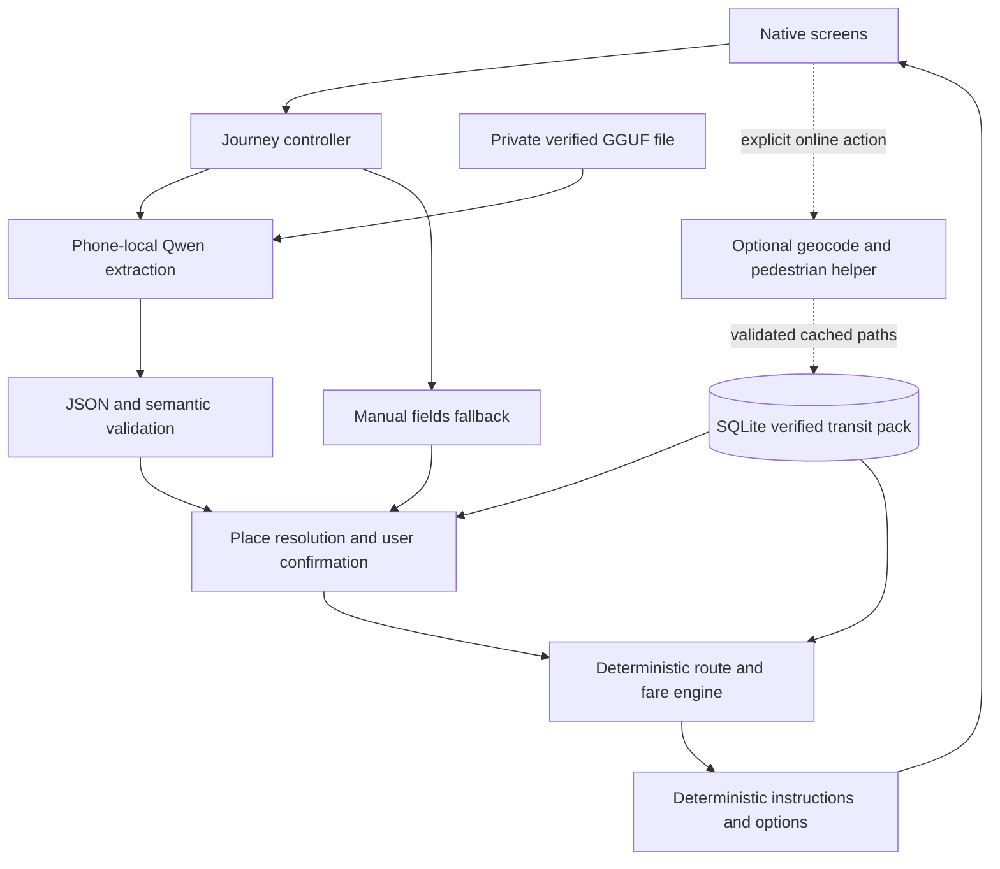
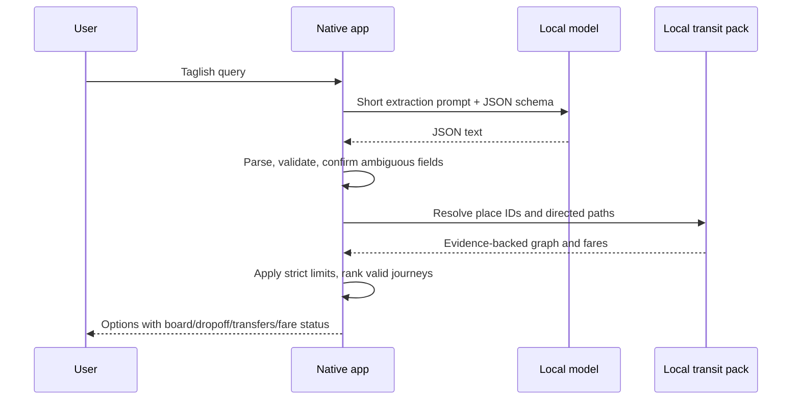

# AlalayByahe — Implementation Planning Package
**Revision 1.0 · 9 October 2026 · implementation approved**

The grilling decisions and implementation are approved. The repository is connected, and Member 4 has integrated the native scaffold, contracts, storage, controller and three members' implementations. Current evidence is in docs/evidence/integration.md. Physical inference, verified corridor coverage and iOS native signing remain unproven. The workspace was empty and unconnected when this plan was originally written.

## Part 1 — Executive Technical Assessment
Build a standalone Android/iOS commute assistant that interprets a short Filipino, English or Taglish request **on the phone**, then computes a journey from a locally stored, source-backed transit graph. Show origin/destination confirmation, boarding point, service direction, dropoff, transfers, walking links and honest fare status.

Use a small native language model for intent extraction, not route invention. Use deterministic routing and instruction templates. The headline demonstration is a new Taglish query after an installed app cold-launches in airplane mode with Metro and USB disconnected.

Two risks dominate: native inference/signing compatibility and missing stop-level provincial data. Validate both at the beginning. A visually complete app with mock inference or invented provincial routes does not pass.

## Part 2 — Requirements and Hackathon Compliance
The participant briefing PDF is **not among the supplied files**. The two pasted prompts are requirements supplied by the team. The [public event page](https://cerebralvalley.ai/e/appbuildersph-hackathon-2026) confirms Oct 9 kickoff, Oct 10 afternoon SM Makati demo, teams of 1–4, repository/demo video, disclosure of AI/open-source tools and building during the event. It does not establish all detailed rules pasted here.

| Requirement | Engineering consequence | Verification |
|---|---|---|
| Meaningful local AI; no cloud AI in core | Native extraction integrated with real route search; airplane-mode proof | Team prompt; briefing confirmation pending |
| Four registered people, AI assistants allowed | Four owned workstreams; record tools/libraries | Team instruction; public page supports team size/disclosure |
| No external human assistance | Use registered teammates and published sources; do not solicit outside route coding/data help | Team prompt; briefing confirmation pending |
| 10 AM Oct 10 submission/code freeze | Treat as internal hard deadline; submit earlier | Pasted rule, exact official deadline unconfirmed |
| Public GitHub, one submission | User controls visibility and single final submission | Pasted rule; verify briefing |
| ~1 minute video; X/LinkedIn tag and hashtag | Prepare video and post draft; user publishes | Work-sharing requirement public; exact format/hashtag pending |
| 5-minute pitch / 3-minute Q&A | Rehearse to these conservative limits | Pasted timing, official timing pending |
| 25/25/20/15/15 rubric | Allocate proof across usefulness/local AI/technical/innovation/product | Pasted rubric, official weights pending |

Member 4 obtains the actual briefing through the team's existing event materials and checks these before publishing/submitting. Do not claim the missing PDF was read. If rules differ, amend schedule/disclosures; do not drop the internal 10 AM safety deadline without a clear official basis. All source dates, package versions and measurements must be genuine.

## Part 3 — Scope and Feasibility Analysis
### Confirmed P0
- Standalone native Android **and** iPhone apps; no paid services required.
- Short Taglish text extraction; editable origin/destination and strict preferences.
- Manual place search when AI fails; this fallback is labeled and is not proof of AI.
- Pre-trip and **manually confirmed** onboard replanning.
- All five mode types: van/UV, jeepney, bus, tricycle and LRT. Show only real evidenced services; a mode type is not proof that every corridor contains it.
- Target all three: Lipa→Candelaria Quezon, Lipa→San Pablo Laguna, Candelaria→Vito Cruz/Taft. Each needs its own end-to-end verification gate.
- Nearest **useful** boarding point: reachable pedestrian path plus a valid onward journey. Closest useful legal dropoff with a pedestrian path to destination.
- Journey-specific transfers, without a fixed transfer-count ceiling.
- Origin/egress walking default 1km; adjustable. Transfer walking default 500 m, adjustable.
- Up to three valid options; explicit restrictions never silently relaxed.
- Verified/estimated/unknown fares, sources and dates; partial subtotal separated from total.
- Local transit pack/model readiness, offline stored-place workflow, error recovery and instructions diagram.

### Conditional online capability
Arbitrary address/GPS input inside relevant coverage is supported only when a geocoder and real pedestrian path are available, or the endpoint/path is already stored. New addresses and uncached walking paths may need internet. Without them, ask the user to choose a stored place. Straight-line distance is not walking distance. The diagram is not a street map.

### Deferred
P1: address/walking helpers if free account works, scanner for a small validated signboard set, optional map and walking handoff, fare expansion. P2: nationwide data, live vehicle arrival, automatic onboard tracking, voice, model fine-tuning, cloud sync/user accounts. Scanner was explicitly cuttable; it cannot block P0.

The user accepted smaller verified demo coverage if necessary. Keep all three as targets, but publish the actual supported subset after the data gate. Do not “fill” missing connections with invented demo data. New tester routes enter review, not the release pack automatically.

## Part 4 — Recommended Technology Stack
| Component | Planning pin | Purpose |
|---|---|---|
| Node / npm | 24.14.0 / 11.9.0 available locally | Toolchain; standardize team Node major |
| Expo / React Native / React | 57.0.27 / 0.86.3 / 19.2.3 | Native Android and iOS |
| expo-router | 57.0.25 | Native screen navigation |
| expo-file-system / expo-sqlite | 57.0.7 / 57.0.4 | Private model storage and local transit database |
| expo-location | 57.0.20 | Foreground position, optional permission |
| expo-build-properties | 57.0.22 | Native build configuration |
| expo-dev-client | 57.0.19 | Development only; demo uses installed release build |
| llama.rn | 0.12.9 | Native llama.cpp inference |
| TypeScript / @types/react | 6.0.3 / 19.2.4 | Installed Expo-compatible type checks |
| tsx | 4.23.15 | Pure TypeScript tests with Node node:test |
| @noble/hashes | 2.4.0 | Incremental SHA256, MIT |

These are proposed exact starting versions from official SDK57 mappings and tagged releases, not an installed lockfile. Member 4 installs once, resolves Expo-required navigation dependencies with expo install, checks expo-doctor, and commits the lockfile. No member independently upgrades dependencies. Expo 57 with llama.rn0.12.9 is **unverified as a combination**; the llama example uses RN0.82.0. Both native builds and real inference must pass the first gate. If it fails, Member 4 and Member 1 select a documented compatible Expo/RN pair, update contract v1.1 and every branch before continuing. Never assume wildcard peer dependencies prove compatibility.

Sources: [Expo SDK57](https://docs.expo.dev/versions/latest/), [official native package mapping](https://raw.githubusercontent.com/expo/expo/sdk-57/packages/expo/bundledNativeModules.json), [template](https://raw.githubusercontent.com/expo/expo/sdk-57/templates/expo-template-default/package.json), [llama.rn tagged release](https://github.com/mybigday/llama.rn/releases/tag/v0.12.9), [tsx release](https://github.com/privatenumber/tsx/releases/tag/v4.23.15).

### Architectural comparison
| Candidate | Benefit | Constraint | Decision |
|---|---|---|---|
| Native Expo/RN + llama.rn | Shared Android/iOS UI; native GGUF runtime; persistent offline resources | Two native toolchains, signing, unverified version combination | Selected; first build gate |
| Android-only native | Simpler one-platform validation | Violates confirmed iPhone requirement | Not the target |
| PWA + WebGPU/Transformers.js | Faster URL distribution | Browser support/storage; user rejected PWA; phone model performance unknown | Not selected |
| Flutter/native ONNX | Native reach; task-specific models possible | Team/toolchain/model conversion overhead | No overnight switch without evidence |
| Desktop llama.cpp/Ollama | Laptop hardware easier; useful fallback | Inference is on laptop, not phone | Accepted disclosed fallback only |
| Phone UI → laptop model | Phone experience while model runs locally on laptop | Requires local network; no phone inference/airplane-mode claim | Last resort, explicitly labeled |

ONNX Runtime/Transformers.js are useful for supported exported models; they add conversion/compatibility work for this selected GGUF path. Tesseract/OpenCV address OCR/image processing, not Taglish intent; no scanner dependency in P0. Lightweight embeddings alone do not robustly resolve negation, origin/destination roles or onboard intent. llama.cpp under llama.rn gives a direct supported GGUF pipeline. Ollama is optional laptop tooling, not a mobile library.

Primary model: **Qwen/Qwen2.5-0.5B-Instruct-GGUF**, Apache-2.0, Q4_K_M.
- Revision: `9217f5db79a29953eb74d5343926648285ec7e67`
- File: `qwen2.5-0.5b-instruct-q4_k_m.gguf`
- Bytes: `491400032` (491.4 MB decimal)
- SHA256: `74a4da8c9fdbcd15bd1f6d01d621410d31c6fc00986f5eb687824e7b93d7a9db`
- Pinned download: `https://huggingface.co/Qwen/Qwen2.5-0.5B-Instruct-GGUF/resolve/9217f5db79a29953eb74d5343926648285ec7e67/qwen2.5-0.5b-instruct-q4_k_m.gguf`

Accuracy upgrade candidate only after measurement: **Qwen/Qwen2.5-1.5B-Instruct-GGUF**, Apache-2.0, Q4_K_M; revision `91cad51170dc346986eccefdc2dd33a9da36ead9`; file `qwen2.5-1.5b-instruct-q4_k_m.gguf`; bytes `1117320736`; SHA256 `6a1a2eb6d15622bf3c96857206351ba97e1af16c30d7a74ee38970e434e9407e`. Do not download both by default.

File bytes are not runtime RAM. Peak memory, cold initialization, Taglish accuracy and speed are **not measured yet**. Initial engineering settings: CPU baseline, context 2048, output limit 256 tokens, temperature 0; one inference at a time. Metal acceleration is an iPhone experiment after correctness; Android OpenCL/NPU is deferred. No fine-tuning.

Sources: [0.5B publisher revision](https://huggingface.co/Qwen/Qwen2.5-0.5B-Instruct-GGUF/commit/9217f5db79a29953eb74d5343926648285ec7e67), [1.5B publisher revision](https://huggingface.co/Qwen/Qwen2.5-1.5B-Instruct-GGUF/tree/91cad51170dc346986eccefdc2dd33a9da36ead9).

### Actual environment and device limits
Windows laptop: i5-13450HX, RTX4050 Laptop ~6 GB VRAM, 23.71 GiB physical RAM. Current Android build uses Node 24.14.0/npm 11.9.0, Android Studio JBR 21.0.10, SDK 36, NDK 27.1.12297006 and CMake 3.22.1. The initial inspection's missing SDK components were provisioned during the actual build; standalone Android compilation now passes. See docs/evidence/builds.md for path/temp fixes and remaining phone gates. No preinstalled model was established. Laptop free RAM changes; measure it before inference.

User reports Mac with Xcode 26.6, no paid Apple Developer membership. Expo 57 documentation requires Xcode 26.4+ and iOS16.4+. [Apple Personal Team](https://developer.apple.com/help/account/basics/about-your-developer-account) permits local device testing with seven-day provisioning; this does not supply TestFlight/App Store distribution. Verify device trust/developer mode/signing immediately. Build and install Release with bundled JS; Expo Go and a Metro-dependent development build are not the demo.

Phones: iPhone14Pro, Huawei “Pro50” (exact identity/variant unconfirmed), Realme10Pro+5G, HonorX9b. Physical RAM, free storage and current OS must be read on each device. Realme regional chip/RAM variants differ; do not assume one global spec. Prioritize iPhone14Pro and one available Android for gates, then test other Androids. No device latency/accuracy claims yet.

## Part 5 — System Architecture




The shared contract defines Result errors, request/result types, storage and lifecycle. The UI never invokes raw generation directly. Native inference runs outside render; stable manager, one completion, cancellable query IDs. Optional network adapters are separate and disabled in offline proof.

## Part 6 — Transportation Data Strategy
### Current evidence boundaries
| Source | What it supports | What it does not establish |
|---|---|---|
| [JAC terminals/routes](https://jacliner.com/terminals-and-routes) | Named terminals and town-level service descriptions | Precise northbound stop order, every town→Buendia connection, current fares/walk links |
| [JAC schedules](https://jacliner.com/schedules) | Operator schedule source candidate | Image contents/timing not verified in research |
| [Candelaria visitor guide](https://candelaria.gov.ph/services/for-visitors/how-to-get-to-candelaria/) | Older description of travel from Buendia toward Candelaria | Current reverse journey, exact legal stop; page refresh inaccessible |
| [LRMC fare matrix](https://lrmc.ph/our-business-featured/fare-matrix/) | Official matrix location, effective-date material | Exact selected-station fare not yet extracted |
| [LRMC station reference](https://lrmc.ph/2021/09/30/lrt-1-unveils-virtual-ikotmnl-train-ride-video-for-national-tourism-week/amp/) | LRT station context | Current entrances, walking connections or live service |
| [Sakay historical GTFS](https://github.com/sakayph/gtfs) | Historical Metro Manila dataset | Current provincial coverage |
| [SafeTravelPH inventory](https://www.safetravelph.org/data-inventory) | Other dataset discovery | Complete Lipa/Candelaria/San Pablo graph |
| [Lipa transport office](https://lipa.gov.ph/public-safety-transportation-and-traffic-management/) | Tricycle regulation/authority | Specific stand service areas and fare table |

No complete primary stop-level feed for the three corridors was found during bounded research. This is a data gap, not proof that services do not exist. Lipa→San Pablo and Lipa→Candelaria currently lack an established verified chain. Candelaria→Vito Cruz needs a verified northbound intercity leg, legal boarding/dropoff and walking connection before an LRT leg can form a complete journey. Do not infer a direct service from a list of towns.

### Acquisition steps
1. Member 2 maintains source register: publisher, URL/document, publication/retrieval dates, license/usage basis, facts supported, checkedBy.
2. Collect exact direction/service/ordered legal boarding and alighting points. Record evidence separately for coordinates, transit connection, permission, service hours and fare.
3. Use published operator/LGU/LRMC sources; properly licensed map facts for coordinates/pedestrian paths. Registered teammate first-hand observations, if event rules permit, need dated notes and specific scope; recollection is not current verified evidence.
4. Source conflicts remain unresolved/unknown; seek another published authoritative reference. Never silently choose a fare.
5. Tricycle edges connect documented stands/service areas only; no invented tricycle service to arbitrary streets. Fare may be unknown, with “Confirm fare with driver.”
6. Source-backed walking links establish access/transfer/egress and directed pedestrian distance. Check actual crossing/access, not aerial adjacency.
7. Validate pack, test forward/reverse separately, perform paper trace of every demo journey against source evidence.
8. Maintain corridor status: evidence gathering → graph complete → source reviewed → end-to-end tested. Only tested complete paths are advertised.
9. Freeze release pack version before regression/video. Preserve last valid dataset on update. Tester contributions are draft records until reviewed.
10. Release validator rejects synthetic test fixtures. Attribution stays available offline.

Small pack design: places, aliases, stops, services, directions, ordered route stops, directed walk links, fare policies, sources and metadata; schema/SQLite in [contract](02-shared-integration-contract.md). Public page facts can be recorded with citation; do not redistribute copyrighted images/tables wholesale without permitted usage.

## Part 7 — Feature-by-Feature Technical Specifications
| Feature | P0 behavior and implementation | Dependencies / failure |
|---|---|---|
| Taglish assistant | Small schema-constrained extraction; editable slots; locally resolve exact/alias/fuzzy names; confirm ambiguity | Model + validator; missing/failure => manual flow |
| Place selection | Stored aliases offline; locality/branch labels; optional GPS/online address | No home inference; inaccurate GPS requires confirm |
| Routing | Directed expanded graph, legal boarding/alighting, Pareto labels; max three options | Verified connections; search-limit error distinct from no route |
| Nearest useful terminal | Rank complete feasible paths by real access-walk length | No disconnected nearby terminal substitution |
| Onboard replan | User confirms current service direction and next stop; evaluate downstream transfer path | No GPS-based vehicle detection or immediate unsafe alight |
| Preferences | All modes, strict exclusions/direct/budget/walk caps; explain no-match; user decides | Unknown fare cannot prove a budget |
| Fare engine | Flat/matrix/documented distance rule once per boarding; ranges/unknown/subtotal | No invented peso values, no automatic discounts |
| Instructions | Templates from JourneyLeg: board at X, service/headsign Y, alight Z; walking steps from source | Missing required instruction => reject incomplete result |
| Offline setup | Model download + integrity + local pack readiness; airplane-mode stored-place flow | Explicit one-time setup; new geography may need online |
| Scanner P1 | Local OCR→tokens→candidate service→user confirmation→same route engine | No runtime selected yet; never block P0 |
| Online helpers P1 | Free account and key behind optional Worker; user action sends address/coords | Quota/account failure => stored-place mode |
| Map P1 | Optional overview, attribution and system-map handoff | No offline-tile promise; UI diagram works without it |

No cloud LLM writes summaries. Templates are enough to communicate grounded plans. Confidence means evidence reliability, not an invented neural certainty percentage.

## Part 8 — UI/UX Blueprint
Proposed screens: setup/readiness, home/search, confirm journey, results/options, journey detail, onboard replan, data/about. Scanner/map are optional later.

Home: one short Taglish input, “Plan my trip,” “Choose places manually,” optional “Use my location.” Always expose origin/destination fields after extraction; label locality. Preferences are a compact sheet: modes, walking caps, fewer transfers, known-fare comparison. Do not hide the manual fallback behind error text.

Setup: model size and WiFi recommendation, Download, progress/cancel/retry, data version and explicit “Ready for offline stored-place trips.” AI and data readiness are separate. It must not say “Offline ready” while the model or pack is absent.

Confirm: origin and destination, ambiguity candidate list, applied strict constraints, onboard current direction/next stop when relevant. User can swap or edit. No silent assumption of home or current vehicle.

Results: up to three cards, why ranked, board/dropoff names, transfer count, total/partial fare distinction, evidence warning; no fastest badge without reliable times. Detail: numbered ride/walk steps, clearly different boarding and alighting labels, headsign, known fare basis/date, compact journey diagram, editable constraints.

Empty/error: specific cause (AI unavailable, unsupported coverage, missing connection, walk limit, mode constraint), preserved user input and relevant recovery action. “No verified complete journey available” can show known terminal facts separately; it cannot display a complete journey-shaped fallback.

Accessibility: native stack/router, safe areas, Pressable accessibility labels/roles, Text wrappers, scalable type, contrast, no color-only warnings, no horizontal clipped forms, reachable large tap targets, screen-reader step order. Test small Android and iPhone large text. Stable callbacks/state, StyleSheet, no expensive model/graph initialization during render. Use translation keys with English/Filipino/Taglish fallback, without changing route names. No dark-pattern model download or permission request.

## Part 9 — Complete Edge-Case Matrix
[Full matrix](05-edge-case-matrix.md) covers every category from the prompt, including deferred scanner cases, native storage/signing and onboard behavior. P0 cases block release if they can fabricate or misdirect a journey; P1 cases only block their optional feature.

## Part 10 — Repository and Implementation Structure
```text
app/                         # Member 3 screens; Member 4 owns _layout.tsx
src/contracts/index.ts       # Member 4, frozen v1.0
src/contracts/validators.ts  # Member 4
src/ai/                      # Member 1
src/routing/                 # Member 2, pure TypeScript
src/data/                    # Member 2 schemas/import/validation
src/storage/                 # Member 4 SQLite/files adapters
src/application/             # Member 4 orchestration and dependency wiring
src/ui/                      # Member 3 components/theme/presentation
src/network/                 # Member 4 optional geocode/walk adapter
assets/data/                 # Member 2 verified release pack only
tests/ai/                    # Member 1
tests/routing/               # Member 2
tests/ui/                    # Member 3 fixtures and manual scripts
tests/integration/           # Member 4
tests/fixtures/              # explicit synthetic test packs, release-excluded
scripts/                     # Member 4 checks; Member 2 data validator by agreement
services/geo-proxy/          # Member 4 optional Cloudflare Worker
docs/evidence/               # anonymized measurements, data provenance
docs/planning/               # this approved planning package
app.config.ts, package.json, package-lock.json, tsconfig.json,
.gitignore, android/, ios/   # Member 4; Member 1 native edits coordinated
```
No model binaries, API keys, .env contents, signing profiles, private device identifiers or personal journey logs in Git. Native folders are generated and kept consistent by Member 4; choose one prebuild strategy and document it. Resolve imports from contracts with explicit relative imports initially; do not invent conflicting aliases.

Standards: strict TypeScript; pure routing has no React/native imports; validators at boundaries; bound SQL; Result errors; integer centavos/meters; stable IDs; single dependency lockfile; explicit fixture labeling; no secrets or model binaries. Native dependencies belong to the application package. Member 4 owns configuration and contracts; Member 1 coordinates native inference changes. Tests focus on behavior and dangerous failures, not mirrored implementation details.

## Part 11 — Detailed Development Roadmap
[All tasks with 17 required fields](03-team-backlogs.md) and [timeline/dashboard](04-team-execution.md) define the execution plan. Current planning time is approximately 9:30 PM Oct 9 Manila; rebase proposed times if approval arrives later, preserving testing/submission buffers.

First ten tasks, with work occurring in parallel after contracts freeze:
1. INT-001: repository/bootstrap/contracts and toolchain check.
2. AI-001: signed native build + real extraction feasibility probe.
3. ROUTE-001: source register and corridor evidence gate.
4. UI-001: shell/theme/native navigation using labeled mocks.
5. INT-002: durable storage and transactional pack import.
6. AI-002: model acquisition/integrity/readiness.
7. ROUTE-002: validated release pack and synthetic test pack separation.
8. UI-002: place/constraint confirmation and manual path.
9. AI-003: structured extraction, validation and held-out evaluation.
10. ROUTE-003: directed journey search and useful terminal selection.

Do not put all integration at the end. First real end-to-end slice must exist by ~12:30 AM. Feature freeze ~4 AM, release proof ~6 AM, video/docs ~7:30 AM, submit ~8:30 AM with buffer to 10 AM.

## Part 12 — Testing and Acceptance Criteria
[Unified checklist and test plan](06-acceptance-and-demo.md). Pure tests use node:test via tsx, typecheck and data validators. Physical device tests prove native inference, signing, memory, cancellation and offline cold launch. Synthetic algorithm tests do not verify transport reality.

Release requires Android and iPhone installed build, one new actual local query, schema+semantic validation, real supported complete path, correct strict preferences, no fake total, recoverable failure, labeled coverage and no demo mocks. All three corridor targets remain unfulfilled until verified; supported subset is explicit if cut.

## Part 13 — Performance and Offline Validation Plan
Targets (not measured): warm extraction p95 ≤10 s over ≥20 fresh queries per primary device; timeout 15 s; cold initialization ≤30 s soft target; small-pack route computation ≤500 ms target. Record actual median/p95, tokens, memory peak via Android profiler/logcat and Xcode instruments where feasible, battery/thermal observations and failures. Report separate cold vs warm and platform/model/runtime versions. Do not fabricate unavailable memory readings.

Test forced app stop → airplane mode → WiFi/Bluetooth off → disconnect USB → Metro stopped → relaunch installed release → new query not precomputed → confirm/result; inspect that optional helpers are disabled. Reboot at least one phone and retest. Offline retained UI screen alone proves nothing. Data/model files must persist, no bridge to laptop. Model download interruption, hash mismatch, storage full, background cancel and restart tested. A model upgrade is conditional on actual accuracy improvement and usable latency/memory.

Laptop fallback: use publisher GGUF with pinned documented llama.cpp/Ollama runtime selected if needed, all route/data processing local on laptop. Label “AI runs locally on this laptop.” If phone sends to it over LAN, label that boundary and do not present phone airplane-mode inference. Manual-only fallback does not satisfy local-AI judging proof. No fallback has been implemented.

## Part 14 — Risk Register and Fallbacks
| Risk | Likelihood / impact | Early trigger | Response |
|---|---|---|---|
| Missing provincial stop/direction data | High / critical | Corridor evidence gate incomplete by midnight | Freeze validated subset; disclose gaps; no invented edges |
| Expo 57 + llama.rn incompatibility | Medium / critical | Build/inference probe fails | Coordinated compatible version change before parallel divergence |
| iOS signing/native entitlements | Medium / critical | Personal Team build/install fails | Disable optional entitlements, fix signing; preserve iPhone target; disclose platform limitation if unresolved |
| 0.5B Taglish semantics | High / high | Held-out role/negation accuracy misses target | Improve short prompt/aliases; require confirmation; measured 1.5B trial if time/storage |
| Android memory/heat/slow generation | Medium / high | Timeout/OOM on device | Short context/output, CPU baseline; test stronger phone; honest laptop fallback |
| NDK/build download delay | High / high | First native compile blocked | Install exact required tools early; UI/data work continue |
| Model transfer/hash delay | Medium / high | No ready model by midnight | Preload phones earlier; no bypass of integrity |
| Optional geo free tier/account failure | Medium / medium | Key/no-card gate fails | Disable helper; stored places and documented walks |
| Late shared-contract divergence | Medium / high | Fields/enum differ across branches | One owner/version commit; small merge checkpoints |
| Unknown/conflicting fares | High / medium | No current policy | Unknown fare + subtotal; do not rank unprovable cheapest |
| Demo crash/device failure | Medium / high | Release soak fails | Second tested device, honest recording/laptop backup |
| Rule mismatch/missing PDF | Medium / high | Briefing differs | User verifies event material; revise submission plan early |

Cut order: map/scanner → online helpers → visual polish → extra datasets/advanced rankings → narrow verified coverage. Keep actual local inference, deterministic route, clarity, failure behavior and offline evidence. See emergency plan below.

## Part 15 — Hackathon Scoring Strategy
Weights below are supplied by the prompt, not independently confirmed official rubric.
| Category | Proposed weight | Evidence to prepare |
|---|---:|---|
| Problem/usefulness | 25% | One unfamiliar commuter query, precise board/dropoff/transfer instruction and honest limitation |
| Local AI | 25% | New airplane-mode extraction with engine/version proof, privacy boundary, no cloud AI |
| Technical execution | 20% | Directed graph tests, fare provenance, two installed native builds, durable offline resources |
| Innovation | 15% | Taglish intent + local constrained extraction + useful terminal/downstream transfer logic |
| Product/demo quality | 15% | Short comprehensible flow, no scripted fake results, backup and rehearsed explanation |

Do not add complexity merely for a score. The defensible distinction is useful locally interpreted language connected to evidence-backed journey computation.

## Part 16 — Demonstration and Pitch Plan
[Timed script and Q&A](06-acceptance-and-demo.md). Lead with commuter uncertainty; show local inference with a fresh Taglish input, confirm fields, route option and one evidence/fare caveat. Show airplane-mode status and no laptop bridge. If a corridor isn't validated, demo only the validated subset and state that clearly. A recording is a backup, not a claimed live benchmark.

## Part 17 — Submission Readiness Checklist
Owner Member 4, with source/AI disclosures from Members 1–2 and demo UI from Member 3. Repo, README, exact installation/dev/release steps, license/attribution, model manifest, supported coverage, offline boundary, tested-device table and measured limitations; ~1 minute video; user-authored posting/submission actions; verify receipt and GitHub visibility before internal deadline. [Complete checklist](06-acceptance-and-demo.md).

Standing instruction: commit/push task-owned changes and verify the remote SHA. The repository is connected to https://github.com/arossmanalo/AlalayByahe.git. Member 4 uses feat/integration/int-001-foundation in an isolated checkout; preserve other members' branches and never force-push shared main.

## Part 18 — Final Recommendation
Use native Expo/RN with llama.rn and Qwen2.5 0.5B Q4_K_M; download once, verify/store privately, extract strict JSON locally, validate/confirm places and preferences, compute directed journey/fare from SQLite, render deterministic instructions. Validate signed native inference and data availability first.

Coverage targets are the three agreed provincial/Taft corridors. Initial release coverage is the source-validated subset; do not pretend it is nationwide or that all target corridors work today. Finish local extraction, manual fallback, useful boarding/dropoff, variable transfers, onboard replan, truthful fares and airplane-mode proof. Postpone scanner/maps/live tracking. The first ten tasks are listed in Part11.

Success at submission: two installed phone apps, a fresh offline Taglish query feeding a real complete supported journey, clear instructions and genuine evidence; known gaps explicitly labeled, all required materials prepared before deadline. No production code is included in this package.

---

## Deliverable 1 — Team Responsibility Matrix
| Member | Ownership | Primary delivery | Boundary |
|---|---|---|---|
| 1 Local AI | src/ai, tests/ai, model evaluation | Real phone inference, lifecycle, strict extraction | No invented routes/fares; coordinate native config |
| 2 Data/routing | src/data, src/routing, assets/data, tests/routing | Evidence-backed graph/fare and directed search | No shared contract edits alone; no automatic tester publication |
| 3 Frontend | screens except root layout, src/ui, tests/ui | Accessible native search/confirmation/results/onboard flows | No raw llama calls, DB schema or dependency drift |
| 4 User/integration | contracts, storage, application, network, build/config, release | Integration from start, installed builds/offline proof, merges/submission | Not a last-minute testing-only role |

## Deliverable 2 — Shared Integration Contract
[Full frozen proposal, types, schemas, function signatures, examples, initialization and ownership](02-shared-integration-contract.md).

## Deliverable 3 — Detailed Task Backlogs
[Every member task, all 17 requested fields](03-team-backlogs.md).

## Deliverable 4 — Parallel Development Timeline
[Timeline, milestones, critical path and central dashboard](04-team-execution.md).

## Deliverable 5 — GitHub Collaboration Strategy
[Branch ownership, commits, PRs, merge checks and shared file coordination](04-team-execution.md#github-workflow).

## Deliverable 6 — Four Ready-to-Paste AI Implementation Prompts
Each includes the project context, assigned full tasks, the complete common contract and sections A–L.
1. [Member 1 — Local AI](prompts/01-local-ai.md)
2. [Member 2 — Transportation Data and Routing](prompts/02-routing-data.md)
3. [Member 3 — Native Frontend](prompts/03-native-frontend.md)
4. [Member 4 — Integration, Offline and QA](prompts/04-integration-qa.md)

## Deliverable 7 — Integration and Acceptance Checklist
[Unified release gates, device and behavioral tests, evidence and submission](06-acceptance-and-demo.md).

## Deliverable 8 — Emergency Scope-Reduction Plan
1. At failed initial native gate: Member 1+4 repair signing/toolchain/version compatibility; Members 2+3 continue pure data/UI contracts. No new native optional modules.
2. At midnight data gap: Member 2 publishes actual corridor status, freezes only verified paths; Member 3 shows gaps and supported coverage. All three remain targets, but cannot be claimed.
3. At 2 AM integration gap: Member 4 merges one working slice; stop optional helpers/scanner/maps. Member 1 supplies actual extraction, Member 2 supplies real pack, Member 3 uses real adapters.
4. At 4 AM feature freeze: only critical correctness/crash/signing fixes. No new rankings or model upgrade. Manual fallback stays; failing AI is openly unavailable.
5. At 6 AM platform failure: use the other verified phone and disclosed laptop fallback for demonstration if needed; explicitly report unfulfilled two-platform requirement. Do not silently redefine target or claim iPhone works.
6. At 7:30 AM: recording/docs/submission take priority. Use measured evidence already captured, disclose missing tests. No fake “passed” checks.
7. If only manual routes work: do not market this as a functioning Local AI entry. Explain that local inference failed and show disclosed backup only if real.
8. No essential work after internal10 AM freeze. Preserve last stable build, dataset/model versions and commit.

These cuts are contingencies, not permission to bypass grounding, privacy, safe transfer or local-inference proof.
