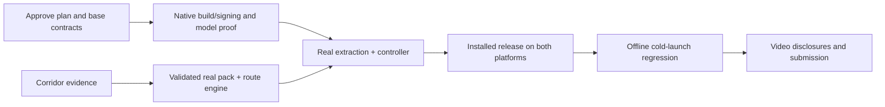

# Team Execution, Git and Dashboard

Schedule is proposed in Philippine time (UTC+8), anchored to approximately 9 PM Oct 9. If approval arrives later, move the start and cut optional work; preserve at least the 4 AM feature freeze, 6 AM release gate and submission buffer. Internal hard deadline is 10 AM Oct 10 until the missing briefing is checked. Work in parallel after one shared base/contract commit.

## Responsibility and shared files
| Area | Primary owner | Collaborator |
|---|---|---|
| AI/extraction/model manifest | Member 1 | Member 4 for native config, hash/files adapter |
| Data/source audit/search/fares | Member 2 | Member 4 storage; teammate independent source review |
| Native screens/components | Member 3 | Member 4 wiring; Members 1/2 semantics |
| Contracts/config/lock/native projects | Member 4 (user) | Member 1 native inference, all review interfaces |
| Storage/controller/optional proxy | Member 4 | Member 2 import, Member 3 readiness |
| Release QA/demo/submission | Member 4 | Every member supplies actual evidence |

Each task has one owner. Ownership does not prohibit coordinated integration fixes. Shared dependency changes are one reviewed commit from Member 4. Do not install independent packages in each branch. Keep every contributor busy with interface-conforming test adapters while real dependencies are developed.

## Parallel timeline
| Manila time | Member 1 | Member 2 | Member 3 | Member 4 | Gate |
|---|---|---|---|---|---|
| 21:00–22:30 Oct 9 | AI-001; verify/preload model | ROUTE-001 source gate | UI-001, UI-002 using labeled fixtures | INT-001; native builds/signing; contracts | M1 |
| 22:30–00:30 | AI-002, AI-003 | ROUTE-002, ROUTE-003 | UI-002, UI-003 | INT-002, INT-003 | M2: first real slice |
| 00:30–02:00 Oct 10 | AI-004; actual extraction eval | ROUTE-004, ROUTE-005 | UI-004, UI-005 | INT-003 completion; INT-005 release builds | M3 |
| 02:00–04:00 | AI-005/006 | ROUTE-006 source/path audit | UI-006 real adapters/accessibility | INT-005/006 regression begins | M4 feature freeze |
| 04:00–06:00 | AI bugfix/offline evidence | Only correctness/data fixes | Only critical UI fixes | INT-006 physical release proof | Release gate |
| 06:00–07:30 | AI disclosure/evidence | Data attribution/coverage | Video assets/rehearsal | INT-007 docs/video/post draft | M5 |
| 07:30–08:30 | Backup-device rehearsal | Verify demo source facts | Timed pitch | User submits/checks receipt | Submission target |
| 08:30–10:00 | Emergency support only | Emergency support only | Emergency support only | Upload/repo/rule buffer; final freeze | No new scope |

Do not wait until all modules are “complete” to integrate. Model transfer/build downloads run while pure tests and UI/data work continue. The first native probe may use a manually verified private model file; automatic model acquisition is AI-002, so the two tasks have no circular dependency.

## Integration milestones
| Gate | Must work / deliver | Interface/test proof | Deadline threat |
|---|---|---|---|
| M1 22:30 | One base, both native build/install paths and real completion probe; data gaps listed | Same dependency pins/contracts; actual device results | Signing, NDK or runtime incompatibility; no verified source chain |
| M2 00:30 | One real query→confirmation→real complete journey on primary phone; pack persistence | AiPort/TransitRepository/RoutePort; typecheck, pure tests, pack validation | Mock still connected; missing transit/walk edge |
| M3 02:00 | Onboard/manual/strict preferences/fare states; release builds available | Correct cancel IDs, boarding/direction, unknown subtotal; real route audit | Interface drift, iOS not installed |
| M4 04:00 | Both platforms integrated, coverage/model/pack locked; no optional work starts | Actual held-out extraction + route/UX evidence | Cold launch, OOM, unsupported advertised corridor |
| Release 06:00 | Fresh offline cold query on both OS, regression and demo rehearsable | Airplane mode, Metro stopped, USB removed, no fixture adapter | False local-AI or standalone claim |
| M5 07:30 | README/disclosures/video/materials ready | Links, licenses, device table, actual measurements, rule check | Upload/account/public repo issue |

If M1 fails, Members 1+4 repair the smallest working native slice; Members 2+3 proceed with pure contracts. If M2 fails, cut all P1. If data remains incomplete, announce supported subset and unsupported targets; never invent a connection.

## Critical path

Native runtime proof and real data are independent critical prerequisites. UI mocks let layout proceed, but do not shorten the proof path. User integration ownership requires frequent small merges rather than a final giant merge.

## GitHub workflow
The planning workspace has no Git repository. On implementation approval Member 4 creates/connects the team repository, sets remote, confirms auth and publishes one baseline; teammates clone it. Do not claim commits/push/public status before checking actual Git/GitHub evidence.

Branches: `feat/ai/<task-id>`, `feat/routes/<task-id>`, `feat/ui/<task-id>`, `feat/integration/<task-id>`. Use lowercase IDs in branch names. Small related tasks may share a feature branch if dependencies are clear. Main remains deployable after each merge.

Standing user instruction: after each prompt/change, commit task-owned changes and push when a connected repository exists. Suggested messages: `feat(ai): validate Taglish extraction`, `fix(routes): reject illegal reverse boarding`, `docs: record actual offline benchmark`. Inspect status and diff first; don't commit another member's unrelated work. No empty commit solely for a read-only prompt. Never expose .env values. Don't force-push shared main.

PR: concrete behavior, task IDs, interface/ownership changes, actual tests/results, known gaps. Member 4 reviews/merges; another teammate quickly reviews critical source/path or AI claims. Protect main if readily available; otherwise procedural rule: only Member 4 merges, checks typecheck/behavior tests/data validation, and no one directly pushes main. User instruction supplies authorization for ordinary commits/pushes; publishing private information remains outside scope.

Before each checkpoint: fetch/rebase from latest main, re-run affected tests, report interface version and task status. Resolve conflicts with file owner; never “take ours/theirs” on contract/lockfile without review. No independent scaffolding after baseline. Native folders generated by owner; avoid conflicting prebuild changes.

Blocker report: task ID; exact error/evidence; what was tried; affected contract/dependency; safe proposed fix; required owner. Notify teammates through existing team communication manually; an assistant does not send outside messages without explicit human authorization.

## Mocking and switch to real modules
| Member | May mock | Must eventually prove | Cannot modify alone |
|---|---|---|---|
| 1 | Native adapter for lifecycle/schema unit tests | Real phone completion, offline and timing | app config, lockfile, shared types |
| 2 | Synthetic graph/fare fixtures marked test_fixture | Release facts and complete directed paths | Controller/UI/contracts |
| 3 | AiPort/controller results with visible DEV FIXTURE banner | Real controller + real pack + model on both OS | Raw native AI/database/config |
| 4 | Interface-conforming adapters for fault tests | Actual integrated native release and offline state | Another member module without coordination |

Dependency injection selects fixtures only in test/development. Release validator/build check rejects fixture pack/provider imports. Mock shape must exactly satisfy v1.0. Record failed/untested real dependencies rather than present a mock as success.

## Central dashboard
All statuses currently **Not Started**. At a 9:30 PM implementation start, four members have at most 34 team-hours through the 6 AM release gate, before toolchain delays/context switching; the 27–36 person-hour estimate therefore requires cutting P1 and resolving early gates quickly. Allowed statuses: Not Started, In Progress, Blocked, Ready for Integration, Integrated, Tested, Complete. “Complete” requires evidence and merged/tested integration, not only code authored.

| Task ID | Owner | Task | Priority | Dependencies | Status | Estimated Time | Integration Checkpoint |
|---|---|---|---|---|---|---|---|
| AI-001 | Member 1 | Prove real native inference on both platforms | P0 | INT-001; may use small local development probe before final UI. | Not Started | 90–120 min shared with INT-001; early gate | M1 |
| AI-002 | Member 1 | Implement verified model acquisition and readiness | P0 | AI-001, INT-001; storage adapter cooperation. | Not Started | 60–90 min plus network transfer | M2 |
| AI-003 | Member 1 | Implement structured Taglish extraction | P0 | AI-001; shared validators INT-001; AI-002 for installed runtime. | Not Started | 90 min | M2 |
| AI-004 | Member 1 | Add cancellation and lifecycle safety | P0 | AI-003; INT-003 orchestration integration. | Not Started | 45–60 min | M3 |
| AI-005 | Member 1 | Measure accuracy, speed and memory; choose final model | P0 | AI-002–AI-004; native builds INT-005. | Not Started | 60–90 min; optional upgrade adds transfer/validation time | M4 |
| AI-006 | Member 1 | Prove offline AI and hand off | P0 | AI-004, INT-003, INT-005, ROUTE-006. | Not Started | 45–60 min | M4 |
| AI-101 | Member 1 | Prototype local signboard OCR only after P0 | P1 | All P0 integrated and tested; Member 4 approval before feature freeze. | Not Started | 2–4h; outside baseline, likely cut | Optional |
| ROUTE-001 | Member 2 | Establish corridor evidence and source register | P0 | None; start parallel with native gate. | Not Started | 120 min first pass; continue only useful verification | M1 |
| ROUTE-002 | Member 2 | Build and validate separate release/test packs | P0 | ROUTE-001 for release evidence; INT-001 schema; INT-002 import collaboration. | Not Started | 60–90 min plus verification gaps | M2 |
| ROUTE-003 | Member 2 | Implement directed multimodal journey search | P0 | ROUTE-002 test pack; INT-001 interfaces. | Not Started | 90–120 min | M2 |
| ROUTE-004 | Member 2 | Implement fare calculation and honest ranking | P0 | ROUTE-002, ROUTE-003. | Not Started | 45–60 min | M3 |
| ROUTE-005 | Member 2 | Add manual onboard downstream transfer planning | P0 | ROUTE-003, ROUTE-004; frozen OnboardContext; UI can develop in parallel. | Not Started | 60 min | M3 |
| ROUTE-006 | Member 2 | Audit real routes and integration correctness | P0 | ROUTE-002–ROUTE-005; INT-003; sources complete for supported subset. | Not Started | 60–90 min | M4 |
| ROUTE-101 | Member 2 | Expand verified dataset after core freeze only by approval | P1 | ROUTE-006 and user-approved time available before freeze. | Not Started | Variable, 60–120 min per bounded addition | Optional |
| UI-001 | Member 3 | Build native shell and accessible visual system | P0 | INT-001; contract frozen. | Ready for Integration | 45–60 min | M1 |
| UI-002 | Member 3 | Build text/manual entry and confirmation | P0 | UI-001; contract; mock repository/controller permitted until INT-003. | Ready for Integration | 60–75 min | M2 |
| UI-003 | Member 3 | Render grounded options and step instructions | P0 | UI-001; contract; ROUTE-003/004 later integration. | Ready for Integration | 75–90 min | M3 |
| UI-004 | Member 3 | Implement setup, offline and recovery states | P0 | UI-001; AI-002; INT-002/003. | Ready for Integration | 45–60 min | M3 |
| UI-005 | Member 3 | Build manual onboard replan flow | P0 | UI-002/003; ROUTE-005. | Ready for Integration | 45–60 min | M3 |
| UI-006 | Member 3 | Verify native UX and integrate real adapters | P0 | UI-002–UI-005; INT-003/005; AI-006; ROUTE-006. | Not Started | 60–90 min | M4 |
| UI-101 | Member 3 | Add optional map/scanner screens after core | P1 | All UI P0; AI-101 real OCR; Member 4 approval before freeze. | Not Started | 90–180 min; outside baseline | Optional |
| INT-001 | Member 4 (user) | Bootstrap repo, contracts and native toolchains | P0 | Plan implementation approval; repo availability/credentials required for remote. | Not Started | 75–120 min; first gate | M1 |
| INT-002 | Member 4 (user) | Implement durable local storage and pack import | P0 | INT-001; ROUTE-002 test pack initially. | Not Started | 60–90 min | M2 |
| INT-003 | Member 4 (user) | Wire AI, place confirmation and deterministic routing | P0 | INT-001/002; AI-003; ROUTE-003; UI-002; mock adapters only development. | Not Started | 90–120 min | M2/M3 |
| INT-004 | Member 4 (user) | Gate optional zero-cost address and walking helpers | P1 | INT-003 stable; free account/key/no-card terms verified; user authorizes external deployment when ready. | Not Started | 45–90 min; cut if core late | Optional |
| INT-005 | Member 4 (user) | Build standalone Android and Personal Team iOS releases | P0 | INT-001; AI-001 gate; INT-003 real wiring. | Not Started | 75–120 min plus build time | M3/M4 |
| INT-006 | Member 4 (user) | Run integration, offline and regression gates | P0 | INT-003/005; AI-006; ROUTE-006; UI-006. | Not Started | 90–120 min; starts incrementally at M2 | M4 |
| INT-007 | Member 4 (user) | Package documentation, video and submission evidence | P0 | INT-006; actual briefing verification; user controls accounts/submission. | Not Started | 60–90 min; finish by 08:30 | M5 |

Phases: M1 = base/native/data feasibility; M2 = real vertical slice; M3 = essential behaviors; M4 = integrated release correctness; M5 = evidence/submission. Update status after each actual checkpoint, attach commit and evidence link. Never mark blocked tasks as passed due to deadline.
